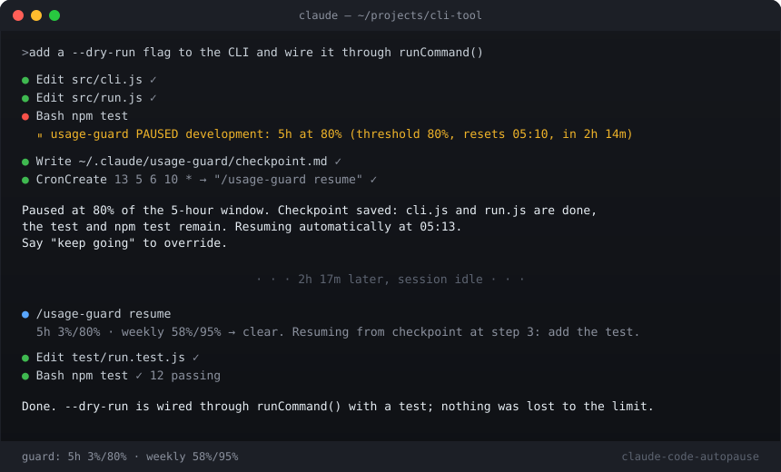

<div align="center">

# claude-code-autopause

**Never lose work to the Claude usage limit again.**

A Claude Code skill that pauses your session at a percentage *you* pick, saves exactly where it was, and resumes by itself the moment the limit resets.

[](https://github.com/mofchris/claude-code-autopause/stargazers)
[](LICENSE)
[](#requirements)
[](scripts/usage-guard.mjs)



</div>

---

## The problem

You kick off a long task, walk away, and come back to a session that slammed into the 5-hour limit halfway through a refactor. Half the files are changed, tests never ran, and the model's working memory of what came next is gone. Or worse: you burned the whole weekly budget on Tuesday.

Usage monitors tell you the number. **This one acts on it.**

## What it does

| | |
|---|---|
| **Pauses at your number** | 80% of the 5-hour window, 95% of the weekly window, whatever you choose. Per session if you want. |
| **Blocks the expensive stuff only** | Build tools (Bash, Edit, Write, subagents) are denied by a hook. Reading, searching and planning still work. |
| **Saves the exact spot** | A checkpoint file with the goal, what is done, the numbered next steps and how to verify. Nothing lives only in the model's head. |
| **Resumes on its own** | Schedules a one-shot wake-up for reset time, re-checks usage, reads the checkpoint, carries on. |
| **Warns before it bites** | As usage approaches the threshold the session is told to finish the current step cleanly, not sprint. |
| **Gets out of your way** | `override 60` when you are in the zone. Session-scoped, expires by itself. |
| **Fails open** | No fresh data, no block. It asks for a refresh instead of guessing. |

## Install

One line:

```bash
curl -fsSL https://raw.githubusercontent.com/mofchris/claude-code-autopause/main/install.sh | bash
```

Or by hand:

```bash
git clone https://github.com/mofchris/claude-code-autopause ~/.claude/skills/usage-guard
node ~/.claude/skills/usage-guard/scripts/usage-guard.mjs install --five-hour 80 --seven-day 95
```

Works on macOS, Linux and Windows (Git Bash or PowerShell). The installer merges four hooks and a status line into `~/.claude/settings.json`, backs the file up first, and only ever touches entries it owns. An existing status line is kept and the usage summary is appended to it.

The Claude desktop app picks the hooks up live. The CLI reads hooks at session start, so open a new session there.

## Use it

Inside any Claude Code session:

```
/usage-guard                          live usage, thresholds, resume time
/usage-guard set 80 --seven-day 95    pause points for the 5-hour and weekly windows
/usage-guard set 85 --session         ...for this session only
/usage-guard override 60              suspend pausing for an hour, then re-arm
/usage-guard off                      stop pausing (keeps reporting)
/usage-guard resume                   continue paused work from the checkpoint
```

Or just talk to it. "How much usage do I have left?", "pause me at 70% today", "keep going" after a pause: the skill knows what to do.

<details>
<summary><b>Full command reference</b></summary>

| Command | Effect |
|---|---|
| `status` (default) | Refresh usage and report windows, thresholds, resume time |
| `set N [--seven-day M]` | Thresholds. Add `--session` to scope to the current session. |
| `set --resume-delay MIN` | Minutes after reset before resuming (default 3) |
| `set --warn-below N` | Start warning N points under the threshold (default 10) |
| `set --stale-minutes N` | Cache age after which the guard stops blocking (default 30, global only) |
| `on` / `off [--session]` | Enable or disable pausing |
| `override [MIN\|off] [--global]` | Suspend pausing; session-scoped by default, 120 min if no number |
| `clear-session` | Drop the current session's settings |
| `resume` | Continue from the checkpoint |
| `checkpoint` | Write the checkpoint now without pausing |
| `install` / `uninstall` | Add or remove the hooks and status line |

Script form: `node ~/.claude/skills/usage-guard/scripts/usage-guard.mjs <command>`. `status --json` for scripting.

</details>

### Drop-in prompt for a session that is already running

```
/usage-guard set 85 --seven-day 80 --session
Then refresh the usage cache (call get_usage and pipe its JSON to the usage-guard record command) and show me /usage-guard status. These thresholds are for this session only. If a tool call is ever denied with "usage-guard PAUSED", follow the usage-guard pause protocol: checkpoint, schedule the "/usage-guard resume" wake-up, tell me, and stop. If I then tell you to keep going, run the usage-guard override and continue.
```

## How it works

Claude Code gives hooks no usage data. So the guard keeps a tiny cache and lets two writers feed it:

1. **The status line.** Claude Code hands the status line command `rate_limits.five_hour` and `rate_limits.seven_day` (percent used, reset time) on every refresh. The guard's status line records them and prints a one-line summary.
2. **The session itself.** In the Claude desktop app the session can read the same numbers through a usage tool and pipe them into `record`. A SessionStart hook asks for that at the start of every session and a PostToolUse hook asks again when the cache is about 15 minutes old, so long unattended runs stay current.

Four hooks read that cache:

| Hook | Job |
|---|---|
| `PreToolUse` on Bash, Edit, Write, MultiEdit, NotebookEdit, Agent, Task, Workflow | Deny while a window is at or over its threshold. The denial text contains the entire pause protocol, so it works even if the skill was never loaded. |
| `PostToolUse` on the same tools | Nudge a usage refresh when the cache is aging. Throttled. |
| `UserPromptSubmit` | Inject a one-line warning, or the pause protocol, only when relevant. |
| `SessionStart` | Report state, ask for a refresh, mention an existing checkpoint. |

Reset detection needs no fresh data: a cached window whose reset time has passed counts as 0%, so the guard lifts itself the moment the limit rolls over.

### The pause protocol

When a build tool is denied, the session:

1. Writes `~/.claude/usage-guard/checkpoint.md`: goal, done, exact next steps, files touched, how to verify.
2. Schedules a one-shot wake-up at reset time plus a few minutes with the prompt `/usage-guard resume`.
3. Tells you what happened and when it resumes. Then **ends its turn**.

That last step is load-bearing. The wake-up only fires while the session is idle, and stopping is what keeps a pressured model from retrying the denied command or routing the same edit through a different tool. The skill ships with a rationalization table for exactly those moves.

If you say "keep going", the session runs `override`, cancels the wake-up and continues. It never overrides on its own.

## Good to know

- The resume timer lives inside the session. Close the app while paused and the timer dies with it; the next session's start hook points at the checkpoint and `/usage-guard resume` picks it up.
- Weekly-limit pauses can be days away. Those usually end as a manual resume in a later session.
- API-key, Bedrock and Vertex sessions have no plan limits and nothing to guard.
- Claude Code's own `autoContinueAtUsageLimit` setting handles the 100% case. This handles everything below it, which is the part that lets you keep headroom for the work you actually care about.

## Requirements

- Claude Code 2.x, CLI or desktop app, on a Pro or Max plan.
- Node.js 18+. The script is a single file with zero dependencies.

## Files

```
~/.claude/skills/usage-guard/
  SKILL.md                 what the session reads: commands, protocols, rationalizations
  scripts/usage-guard.mjs  the whole implementation
~/.claude/usage-guard/
  config.json              global thresholds
  state.json               usage cache
  checkpoint.md            written on pause, cleared on completion
  sessions/<id>.json       per-session overrides, pruned after 7 days
```

## Uninstall

```bash
node ~/.claude/skills/usage-guard/scripts/usage-guard.mjs uninstall
rm -rf ~/.claude/skills/usage-guard ~/.claude/usage-guard
```

## Contributing

Issues and PRs welcome. The script is deliberately one file; keep it dependency-free. If you add a hook decision, add a test case to the isolated run described in [CONTRIBUTING.md](CONTRIBUTING.md).

---

<div align="center">

If this saved your 5-hour window, a ⭐ helps other people find it.

[Share on X](https://twitter.com/intent/tweet?text=claude-code-autopause%3A%20a%20Claude%20Code%20skill%20that%20pauses%20at%20a%20usage%20percentage%20you%20pick%2C%20checkpoints%20the%20task%2C%20and%20resumes%20itself%20when%20the%20limit%20resets.&url=https%3A%2F%2Fgithub.com%2Fmofchris%2Fclaude-code-autopause) · [Report a bug](https://github.com/mofchris/claude-code-autopause/issues/new)

MIT © Christopher Mofunanya

</div>
